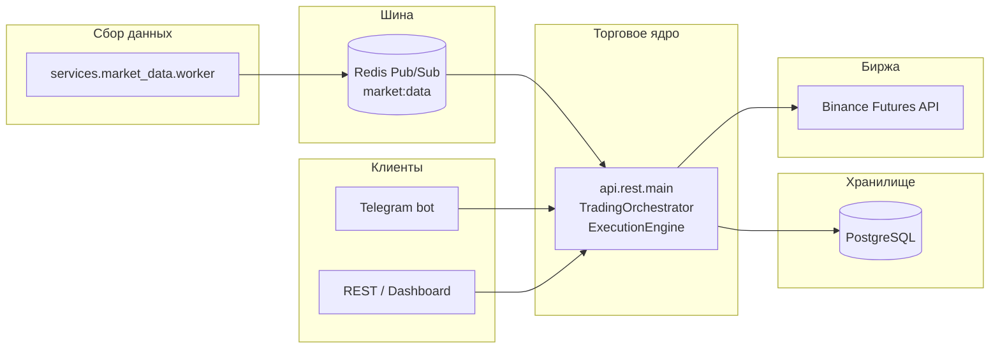

# Quant Trading Bot

Алгоритмическая торговая платформа для **Binance USDT-M Futures**: сбор рыночных данных, генерация и фильтрация сигналов, исполнение ордеров, учёт позиций и PnL, административный **Telegram-бот** и **REST API** на **FastAPI** (async).

> **Предупреждение.** Торговля деривативами связана с высоким риском. Проект предназначен для образовательных и исследовательских целей. Авторы не несут ответственности за финансовые потери. Перед работой на реальных средствах используйте **testnet** и собственную проверку логики.

---

## Содержание

- [Возможности](#возможности)
- [Архитектура](#архитектура)
- [Технологический стек](#технологический-стек)
- [Требования](#требования)
- [Быстрый старт](#быстрый-старт)
- [Конфигурация](#конфигурация)
- [Сервисы Docker Compose](#сервисы-docker-compose)
- [REST API](#rest-api)
- [Стратегии и пайплайн сигналов](#стратегии-и-пайплайн-сигналов)
- [База данных и миграции](#база-данных-и-миграции)
- [Мониторинг и наблюдаемость](#мониторинг-и-наблюдаемость)
- [Вспомогательные скрипты](#вспомогательные-скрипты)
- [Тестирование](#тестирование)
- [Структура репозитория](#структура-репозитория)
- [Безопасность](#безопасность)
- [Известные ограничения](#известные-ограничения)

---

## Возможности

| Область | Описание |
|--------|----------|
| **Рынок** | Отдельный worker публикует события (OHLCV, стакан, фандинг, сделки) в Redis; торговый движок подписывается и обновляет состояние. |
| **Стратегии** | Ансамбль правил по методологиям в духе Schwager / технический анализ: Donchian, WRD, сжатие волатильности, MA trend, pullback, Williams %R, WR reversal, funding squeeze, Rule of 7, Bollinger mean reversion, fakeout; мета-роутинг по режиму рынка (ADX / trend vs range vs neutral). |
| **Фильтры** | Старшие ТФ (1W/1D bias), режим volatility/funding/session, скоринг, внутренняя модель вероятности, опционально внешние LLM (cascade), ML-валидатор (shadow/live), CVD, новостной фильтр, лимиты риска и корреляций. |
| **Исполнение** | `ccxt.pro`, Binance Futures, reconcile позиций/ордеров, аудит жизненного цикла сигнал→ордер→позиция, trade management (break-even, частичное закрытие, time stop и др. по настройкам). |
| **Данные** | PostgreSQL (async SQLAlchemy): сигналы, ордера, позиции, PnL, журнал решений по фильтрам, AI/ML логи. |
| **Управление** | Telegram (админ-команды, webhook), REST с API-ключом, встроенная HTML-страница `/dashboard`. |
| **Наблюдаемость** | Prometheus metrics (в т.ч. воронка сигналов), опционально Grafana + Prometheus в Compose. |

---

## Архитектура



- **Trading Engine** один процесс uvicorn: поднимает БД, биржевой клиент, оркестратор сигналов, фоновый reconcile.
- **Telegram-бот** — отдельный процесс; для вызова REST движка использует HTTP (см. [известные ограничения](#известные-ограничения)).
- **Market Data** — пишет в Redis; движок читает и не блокирует event loop тяжёлыми расчётами индикаторов (частично через thread pool).

---

## Технологический стек

- **Язык:** Python 3.11 (образ по умолчанию в Docker).
- **Web:** FastAPI, Uvicorn, HTTPX.
- **Биржа:** CCXT / CCXT Pro, WebSockets.
- **БД:** PostgreSQL 15, SQLAlchemy 2 (async), Alembic.
- **Кэш/очередь событий:** Redis 7.
- **Наука о данных:** NumPy, Pandas; ML — scikit-learn (по фичам проекта).
- **Метрики:** prometheus_client.
- **Бот:** python-telegram-bot 21+.
- **Контейнеризация:** Docker, Docker Compose (профили `dev` / `prod` для прикладных сервисов).

Зависимости: [`requirements.txt`](requirements.txt).

---

## Требования

- Docker Engine + Docker Compose v2 **или** локально: Python 3.11+, PostgreSQL, Redis.
- Учётные данные Binance (для testnet или production futures).
- Токен Telegram-бота и список `ADMIN_USER_IDS` для административных функций.

---

## Быстрый старт

### 1. Клонирование и окружение

```bash
git clone <repository-url>
cd QuantTradingBot
cp .env.example .env
# Отредактируйте .env: токены, DATABASE_URL, REDIS_URL, TESTNET, ADMIN_USER_IDS и т.д.
```

### 2. Запуск стека (Docker)

Прикладные сервисы объявлены с **профилем** `dev` или `prod` — без профиля поднимутся в основном только инфраструктурные зависимости (например Postgres/Redis).

```bash
docker compose --profile dev up -d --build
```

Типичные порты после старта:

| Сервис | Порт (хост) | Назначение |
|--------|-------------|------------|
| Trading Engine | 8000 | FastAPI / Webhook Telegram |
| PostgreSQL | 5440 | БД (маппинг на 5432 в контейнере) |
| Redis | 6379 | Pub/Sub и state риска |
| Prometheus | 9090 | Скрапинг метрик (при поднятом профиле) |
| Grafana | 3000 | Дашборды (при поднятом профиле) |

### 3. Миграции БД

Рекомендуется явно применить миграции Alembic:

```bash
python3 -m alembic -c alembic.ini upgrade head
```

Подробнее: [`MIGRATIONS.md`](MIGRATIONS.md). При первом запуске приложение может создать таблицы через `create_all`; для продакшена предпочтителен единый путь через Alembic.

---

## Конфигурация

Основной источник правды — **переменные окружения** и класс [`config/settings.py`](config/settings.py) (Pydantic Settings).

Обязательно проверьте:

| Переменная | Назначение |
|------------|------------|
| `TELEGRAM_BOT_TOKEN` | Токен бота |
| `ADMIN_USER_IDS` | Список Telegram user id через запятую |
| `DATABASE_URL` | Async PostgreSQL URL (`postgresql+asyncpg://...`) |
| `REDIS_URL` | URL Redis |
| `TESTNET` | `True` — Binance Futures testnet и тестовые ключи |
| `API_KEY_BINANCE` / `SECRET_API_KEY_BINANCE` | Реальная биржа |
| `TEST_API_KEY_BINANCE` / `TEST_SECRET_API_KEY_BINANCE` | Testnet |
| `INTERNAL_API_KEY` | Ключ для защищённых REST-маршрутов (не оставляйте `changeme_for_prod`) |
| `WEBHOOK_URL` / `WEBHOOK_SECRET` | Webhook Telegram (если используете webhook-режим) |

Расширенный пример с AI cascade: [`.env.example`](.env.example).

Ключевые **торговые** параметры (риск на сделку, просадка, лимиты позиций, режимный роутинг ADX, пороги скоринга, trade management, комиссии для оценки R) задаются в `settings` и могут переопределяться через env согласно именам полей в `Settings`.

---

## Сервисы Docker Compose

| Сервис | Описание |
|--------|----------|
| `postgres` | PostgreSQL |
| `redis` | Redis |
| `market-data` | Worker рыночных данных → Redis |
| `trading-engine` | Uvicorn [`api.rest.main:app`](api/rest/main.py) |
| `bot` | Telegram: `python -m api.telegram.main` |
| `prometheus` / `grafana` | Наблюдаемость (профиль dev/prod) |

Сервис `ml-worker` в Compose закомментирован; при необходимости включается вручную.

Образ приложения собирается из [`Dockerfile`](Dockerfile); базовый образ можно переопределить через `DOCKER_PYTHON_IMAGE` (см. комментарии в `.env.example`).

---

## REST API

Базовый URL по умолчанию: `http://localhost:8000`.

- **`GET /health`** — проверка живости (без ключа).
- **`GET /metrics`** — Prometheus exposition (без ключа в коде по умолчанию — ограничьте доступ на периметре).
- **`POST /webhook/telegram`** — приём обновлений Telegram при webhook-режиме (проверка `X-Telegram-Bot-Api-Secret-Token`).
- **Защищённые маршруты** — заголовок `X-API-Key: <INTERNAL_API_KEY>` (см. зависимость `verify_api_key` в [`api/rest/main.py`](api/rest/main.py)).

Группы `/api/v1/*` (неполный перечень):

- Состояние: `status`, `runtime-settings`, `toggle`, пресеты настроек.
- Рынок и AI: `market-overview`, `ai/status`, `ai/decisions`, `decision-logs`, `signals`, `ml/status`.
- Торговля: `positions`, `trades`, закрытие/редукция, `history`, `stats`, `orders`, `execution-audit`.
- Риск и прочее: `risk/daily`, `learner/status`, `cvd`, `news-filter`.

Встроенный операторский UI: **`GET /dashboard`** (страница с автообновлением; для продакшена рекомендуется не экспонировать без авторизации).

---

## Стратегии и пайплайн сигналов

1. История OHLCV по символам и таймфреймам дополняется из потока Redis и REST при необходимости.
2. Для сигнальных таймфреймов (`1h`, `4h`, `15m` и др. по матрице в коде) считаются индикаторы; решение принимается по **последней закрытой** свече (без lookahead на формирующийся бар).
3. **`MetaStrategy`** отбирает подмножество стратегий по режиму (trend / range / neutral).
4. Каждая стратегия из допустимого набора вызывается только на разрешённых для неё ТФ.
5. Сырые сигналы проходят цепочку фильтров (MTF bias, режим volatility/funding, дубликаты позиций, лимиты, скоринг, AI/ML и т.д.); результат пишется в **`signal_decision_logs`**, принятые кандидаты — в **`signals`** и передаются в **`ExecutionEngine`**.

Имена стратегий и режимные матрицы настраиваются в коде и через `strategy_regime_matrix` (JSON в настройках), при необходимости.

**Порядок и «двойной» ADX (S1):** сначала **`MetaStrategy`** по ADX и ценовому контексту относит рынок к ведру **trend / range / neutral** и тем самым ограничивает *какие стратегии вообще считаются* (`regime_adx_trend_min`, `regime_adx_range_max` в настройках). Уже *после* сырого сигнала и прохождения MTF bias и **regime router** (volatility / funding / session) для подмножества трендовых стратегий (**MA Trend**, **Donchian**, **Pullback**) действует отдельный порог **`ADX < 20` → отказ** (`FILTERED:adx_threshold`, стадия `filtered_adx_threshold`). Это второй слой: он не заменяет мета-ведро, а отсекает слабый тренд на входе; при тюнинге меняйте оба уровня осознанно.

**Hunting 1h/4h → 15m и Funding Squeeze (S2):** на **15m** для mean-reversion и похожих входов требуется недавний сетап с **1h/4h** в том же направлении — явный список в коде: `_STRATEGIES_REQUIRING_PENDING_SETUP_ON_15M` (**Williams R**, **Pullback**, **WRD Reversal**, **BB Mean Reversion**, **Fakeout**). **Funding Squeeze** в этот список **намеренно не входит**: сигнал событийный (экстремальный фандинг/режим), его не привязывают к обязательному H1/H4-сетапу. Отсутствие сетапа у «охотничьих» стратегий фиксируется в телеметрии: **`FILTERED:no_pending_setup`**, стадия **`filtered_no_pending_setup`** (S3).

---

## База данных и миграции

Модели: [`database/models/all_models.py`](database/models/all_models.py) — пользователи, позиции, ордера, сигналы, PnL, пресеты, AI/ML и execution audit.

**Alembic:** каталог `migrations/`, конфигурация `alembic.ini`. Команды — в [`MIGRATIONS.md`](MIGRATIONS.md).

---

## Мониторинг и наблюдаемость

- Счётчики и гистограммы: **`utils/metrics.py`** (в т.ч. `trading_signals_generated_total`, `trading_signal_stage_total`, латентность AI, события trade management).
- При старте приложения может подниматься вспомогательный HTTP-сервер метрик на порту **9091** (если порт свободен).
- **Prometheus** (Compose): конфиг [`monitoring/prometheus/prometheus.yml`](monitoring/prometheus/prometheus.yml).
- **Grafana**: provisioning в [`monitoring/grafana/provisioning`](monitoring/grafana/provisioning).

Скрипт проверки здоровья (Telegram, БД, Binance, логи):

```bash
python3 scripts/monitor_bot_health.py --duration 600 --interval 60
```

---

## Вспомогательные скрипты

| Скрипт | Назначение |
|--------|------------|
| [`scripts/audit_db_exchange.py`](scripts/audit_db_exchange.py) | Сверка открытых позиций БД ↔ Binance Futures |
| [`scripts/monitor_bot_health.py`](scripts/monitor_bot_health.py) | Периодический health-check |
| [`scripts/evolve_strategies.py`](scripts/evolve_strategies.py), [`scripts/multi_backtest.py`](scripts/multi_backtest.py) | Исследование/бэктесты (офлайн) |

Код выхода `audit_db_exchange.py`: `0` — расхождений по OPEN нет, `1` — ошибка или несоответствие.

Отчёт по equity (Plotly): [`services/dashboard/visualizer.py`](services/dashboard/visualizer.py).

---

## Тестирование

```bash
python3 -m pip install -r requirements.txt
python3 -m pytest -q
```

В репозитории есть модульные и интеграционные тесты по исполнению, риску, стратегиям, Telegram, оптимизатору и др. (`tests/`).

---

## Структура репозитория

```
├── api/                 # FastAPI (REST), точка входа торгового ядра
├── api/telegram/        # Telegram-бот
├── config/              # Настройки Pydantic
├── core/                # Стратегии, риск, исполнение, индикаторы, аудит
├── ai/                  # Фичи, модели, бэктест, learner
├── database/            # Сессии SQLAlchemy, модели
├── services/            # Signal engine, market data, dashboard, ml_worker
├── utils/               # Логирование, метрики, Binance helpers
├── migrations/          # Alembic
├── scripts/             # Операционные и исследовательские скрипты
├── tests/               # Pytest
├── monitoring/          # Prometheus / Grafana
├── docker-compose.yml
├── Dockerfile
└── requirements.txt
```

Каталог **`scratch/`** содержит экспериментальные сценарии и не является частью поддерживаемого API.

---

## Безопасность

- Не коммитьте `.env` с реальными ключами.
- Установите надёжный **`INTERNAL_API_KEY`** перед публикацией REST в сеть.
- Ограничьте доступ к `/metrics`, `/dashboard` и админ-функциям Telegram.
- Храните API-ключи Binance с минимально достаточными правами (Futures trading — только если нужно автоторговлю).
- Шифрование пользовательских ключей (если используется модель `ApiKey`) зависит от `ENCRYPTION_KEY` — держите его в секретах.

---

## Известные ограничения

- **Telegram-бот и URL движка:** в [`api/telegram/main.py`](api/telegram/main.py) по умолчанию задан `ENGINE_URL = "http://localhost:8000"`. В Docker-сети контейнер бота должен обращаться к хосту сервиса **`trading-engine`** (например `http://trading-engine:8000`), иначе меню не достучится до API — требуется правка кода или вынесение URL в переменную окружения при доработке.
- **Глобальный объект `settings`:** часть runtime-эндпоинтов меняет настройки в памяти; горизонтальное масштабирование нескольких инстансов движка без общего хранилища конфигурации не поддерживается «из коробки».
- **README не является финансовой рекомендацией:** проверяйте соответствие законодательству вашей юрисдикции.

---

## Лицензия

Файл лицензии в репозитории не зафиксирован; уточните условия использования у владельца кода перед распространением.
